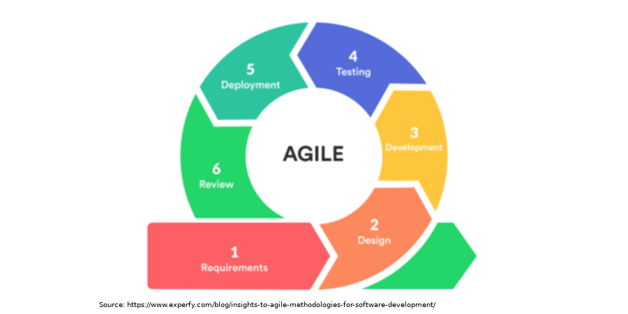
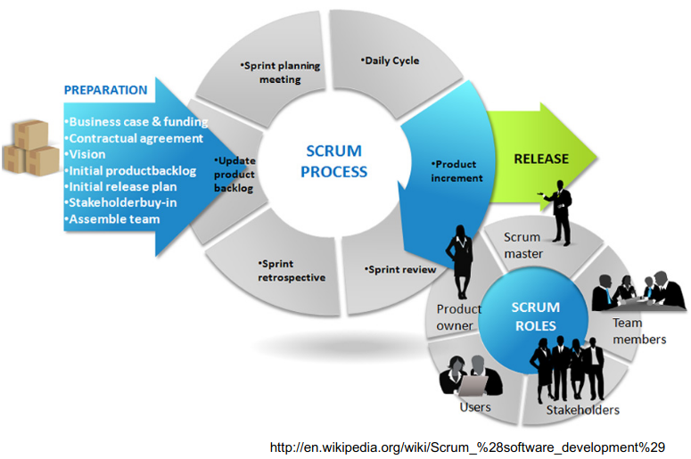

# Welcome to Team A F

- <small><i>Table of contents</i></small>
    + [Team Members](#team-members)
    + [Supervisor](#supervisor)
    + [Stakeholders](#stakeholders)
    + [Project Methodology](#project-methodology)
    + [Scrum Process](#scrum-process)
    + [The Scrum Team](#the-scrum-team)
    + [The Product Owner](#the-product-owner)
    + [The Scrum Master](#the-scrum-master)
    + [The Development Team](#the-development-team)
    + [Gate 1](#gate-1)
    + [Gate 2](#gate-2)
    
    
### Team Members
* [Areeba Abidi](https://eclass.yorku.ca/eclass/user/view.php?id=31348&course=6123)
* [Siddharth Bhardwaj](https://eclass.yorku.ca/eclass/user/view.php?id=23776&course=6123)
* [Jonathan Blumenfeld](https://eclass.yorku.ca/eclass/user/view.php?id=38821&course=6123)
* [Shivani Joshi](https://eclass.yorku.ca/eclass/user/view.php?id=22345&course=6123)
* [Priyam Shah](https://eclass.yorku.ca/eclass/user/view.php?id=39145&course=6123)

### Supervisor
[Franz T. Newland](https://eclass.yorku.ca/eclass/user/view.php?id=8056&course=6123)

### Stakeholders
* Dr. Sandip Joshi, McH General Surgeon
* Dr. Kunal Kanakia, MD
* Dr. Ashish Dave, McH Cancer Surgeon
* Dr. Amish Shah
* Dr. Lopa Trivedi
* Dr. Samir Babaria
* Dr. Anjum Asif

### Project Methodology

### Scrum Process

### The Scrum Team 

Scrum Teams are self-organizing and cross-functional teams- choosing how best to accomplish their work, rather than being directed by others outside the team.

They consist of a ***Product Owner, the Development Team, and a Scrum Master.***

### The Product Owner
Is responsible for maximizing the value of the product resulting from work of the Development Team. Also, is solely responsible for managing the Product Backlog.

***Our team’s Product Owner is Shivani Joshi.***

### The Scrum Master
The Scrum Master is responsible for promoting and supporting Scrum- helping everyone understand Scrum theory, practices, rules, and values.

***Our team’s Scrum master is Jonathan Blumenfeld.***

### The Development Team
The Development Team consists of professionals who do the work of delivering a potentially releasable. Their work increments the progress of "Done" product at the end of each Sprint.

Our team’s development team includes:
* Areeba Abidi
* Siddharth Bhardwaj
* Jonathan Blumenfeld
* Shivani Joshi
* Priyam Shah

***

### Gate 1

> **_NOTE:_** For each Gate1 deliverable- Product Vision, and Agile sub-sections; please click on the subsection heading to be redirected to our team's detailed explanation for that respective section.

### [Product Vision](docs/gate1/product-vision.md) 

Includes information on:
   * Target Group 
   * Problem Solved by Product
   * Product description, uniqueness, feasibility
   * Product societal benefits

### [Feature Roadmap](docs/gate1/feature-roadmap.md)
A product release timeline for our project. 

### [Sprint Planning](docs/gate1/sprint-planning.md)
Define what can be delivered in the sprint and how that work will be achieved.

* ["Daily" Scrum](docs/gate1/sprint-planning.md)

The Stand Up (Daily Scrum) is a 30-minute time-boxed event for the Project Team. At it, the Project Team discusses what was done in the last 48 hours and goes over what will be done in the next 48 hours.

### [Sprint Review Plan](docs/gate1/sprint-review.md)
Address backlog and decide what to move over to upcoming sprint i.e. Did we get the work done, and what feature will move our product forward?

### [Sprint Retrospective Plan](docs/gate1/sprint-retrospective.md)
How is the process of running a sprint going? Should we change something?

*** 

### Gate 2

> **_NOTE:_** For each Gate2 deliverable- presented as sub-sections below; please click on the subsection heading to be redirected to our team's detailed explanation for that respective section.

### [Assign, track and assess team tasks and performance](docs/gate2/team-task-and-performance.md)
Rubric Point #1: Show how you’re assigning and accessing team tasks and performance. 

### [Decompose features into daily sprint tasks](docs/gate2/features-to-daily-sprint-tasks.md)
Rubric point #2- How did we decompose features into daily tasks?

### [Review Sprint Completion Status](docs/gate2/sprint-completion-status.md)
Rubric point#3- Method that shows effective tracking of completed tasks in a sprint(s).

### [Review Sprint Effectiveness](docs/gate2/sprint-effectiveness.md)
Rubric Point#4- Show how our Sprint(s) was effective.

### [Appropriateness of Sprint Plan](docs/gate2/appropriateness-of-sprint-plan.md)
Rubric Point#5- Show how our Sprint Plan(s) was appropriate.

### [ITPMetrics Feedback Complete for every team member](docs/gate2/gate2-itpmetrics.md)
Rubric Point#6- Shows our team's survey completion status.

***

### December MVP
### [Contribute to a team in an appropriate and meaningful way](docs/gate2/gate2-itpmetrics.md)
Rubric Point#1- Show how contribution of team memebers' is appropiate for the team, and suppourts team success.

### [Apply an iterative process to refine or assign solutions for a given engineering design problem](docs/gate2/gate2-itpmetrics.md)
Rubric Point#2- Shows hows a appropiate iteration(s) was applied to refine or assign solutions for a given engineering design problem.

### [Achieve a system design breakdown for management and implementation](docs/gate2/gate2-itpmetrics.md)
Rubric Point#3- Shows the system breakdown for project managenment and implementation. Identifying integration of subsystems to design a complete system.

### [Justify the strength and limitations of the solution and make recommendation for possible improvements](docs/gate2/gate2-itpmetrics.md)
Rubric Point#4 Shows justification of strenghts and limitations of the solution. Also, makes reccomendations for future improvements.

### [Concise and coherent document that reflects critical analysis and synthesis](docs/gate2/gate2-itpmetrics.md)
Rubric Point#4- This website is the "report" though. ***Come back to this @Siddharth***.

### [Design has been reviewed forNo or superficial review sustainability impact and potential for negative unintended consequences](docs/gate2/gate2-itpmetrics.md)
Rubric Point#5- Shows how MVP has been reviewed for issues or oppurtunities around Sustainable Development Goals (SDGs). Also potential unintended negative consequences for a number of stakeholders has been explored.

### [Adjust project schedule based on Does not determine necessary adjustments to project status](docs/gate2/gate2-itpmetrics.md)
Rubric Point#6- Shows how appropiate adjustments were made to the MVP delivery schduele based on project status.

### [Monitor Risks during the life-cycle of the Project](docs/gate2/gate2-itpmetrics.md)
Rubric Point#7- Shows how key risks were monitored during the life-cycle of MVP.

### [Applies all appropriate engineering concepts and fundamentals, theories and practices to solve the engineering problems](docs/gate2/gate2-itpmetrics.md)
Rubric Point#8- Shows how relavant engineering concepts and fundamentals, theories and practices were applied to solve the engineering probelms identified in development of the MVP.
