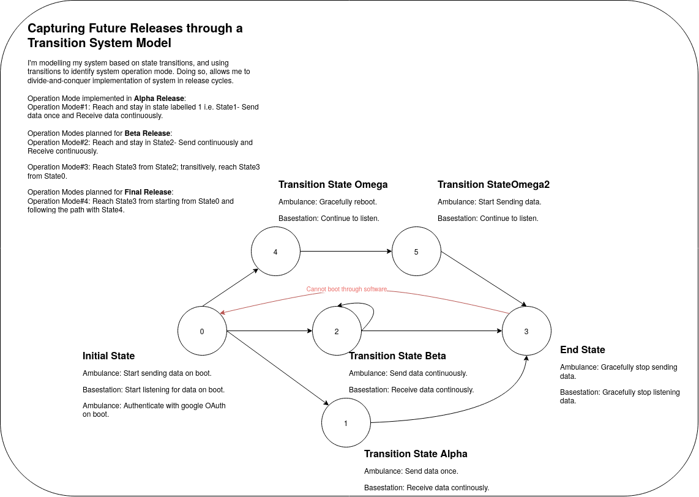
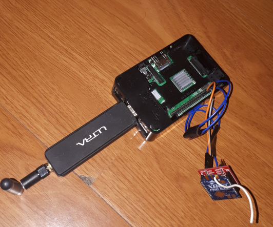
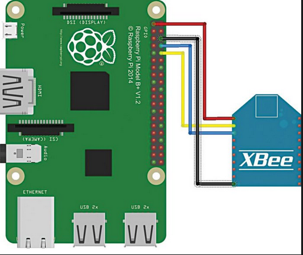
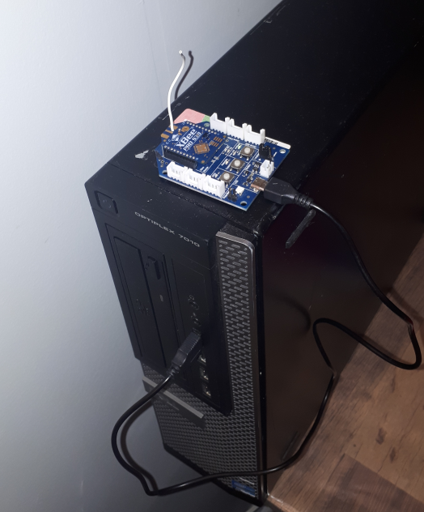
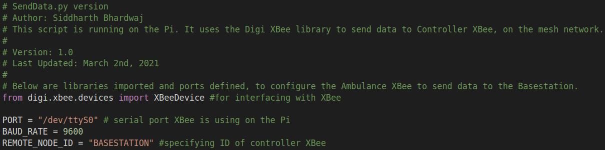
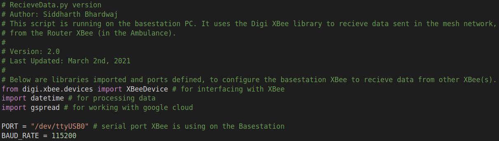
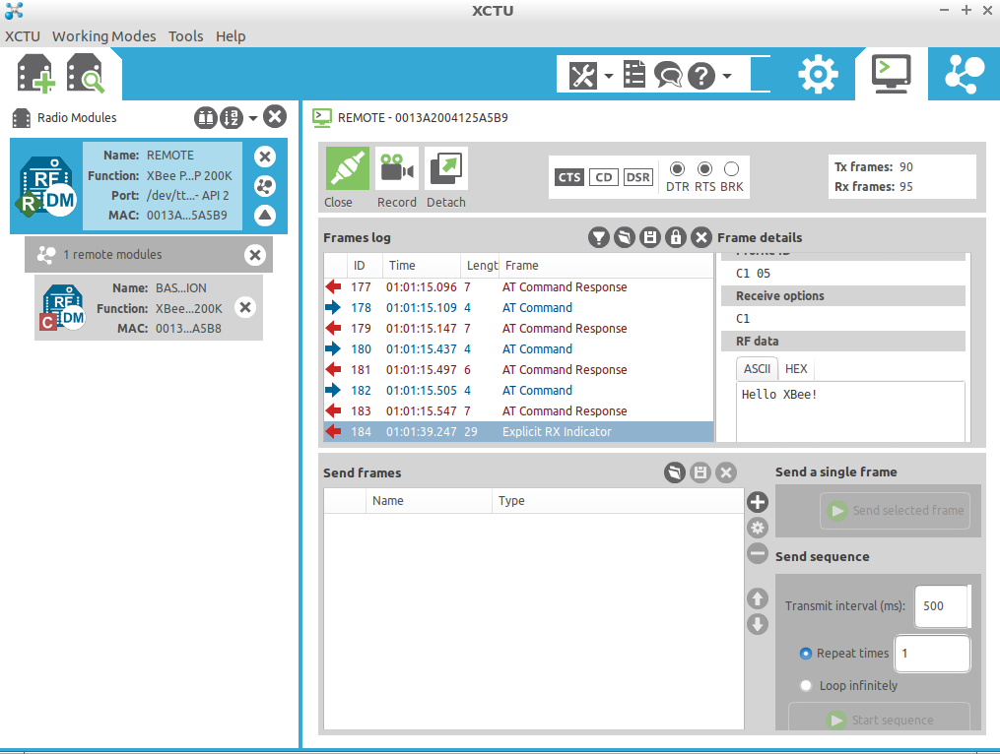
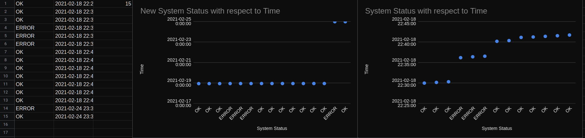

### Page Index
- <small><i>Table of contents</i></small>
    + [About](#about)
    + [Background](#background)
    + [Product Vision](#product-vision)
    + [Planned Releases](#planned-releases)
    + [Application Architecture](#application-architecture)
    + [Configuration Management](#configuration-management)
    + [Testing](#testing)
    + [Alpha Release Results](#alpha-release-results)

### About
Alpha release of a system health reporting application, utilizing XBee transceivers and Raspberry Pi3 to create a mesh network that uses peer-to-peer communication- visualizing and presenting the data transmitted within the nework as information, on a real-time web-based dashboard.

### Background
Addresses: What is this project about and Why?  
At of the start of the winter semester, our team decided to split into two-subteams. One dealing with the pump device, and the other dealing with failure reporting and visualizing system health. I took ownership of the latter. (More information about our project can be found [**here**](https://drive.google.com/file/d/1fbR2aad2eUqU_aILc2vjHCjWiD7Ffg1f/view?usp=sharing).)

In this part of the project, under the supervision of Professor.Franz Newland, I’m building a robust mechanism to collect health data of the automated BVM system. The end-goal is to share this data real-time with the ambulance crew and base station personnel that monitor the health of the system.  

### Product Vision
Addresses: What is it doing?  
This product is:
* Providing mechanism to report issues.
* Providing a low cost, mesh based communication. Allowing others abumblances to support a crew that might have fault.
* Provide a way to visualize data as gathered.

At the moment there is no automated reporting of device failures in an Ambulance operating in Gujarat, India. Thus, there is a need for automated failure reporting for mobile medical devices, used in various medical fields.

In essence, through this solution, the ambulance crew does not need to manually report/call-in a failure to the basestation personnel. Furthermore, it allows one ambulance crew to support another, incase one experiences fault. The value is: if a automated BVM unit fails then a higher load is placed on the crew, on top of pressure of caring for patients. This solution minimizes the high workload placed on the ambulance crew, allowing them to focus on their patients while providing a robust mechanism for reporting system failure. Furthermore, system health data that is collected realtime, is visualized realtime i.e. is leveraged to allow base station personnel to formulate a meaningful strategy to handle system failure (for example, re-route other active ambulances on the mesh network for support, incase one ambulance is experiencing fault with it's BVM).

### Planned Releases
 
**Figure1 shows the transition system model of this application. It attempts to visualize operation modes of various components of this system. Though not correct in principle, I use the red (arrow) edge to identify a constraint, for my convinience.**

Beta Release- March 29th.  
Key Features:  
-Read in sensor data realtime. (using heartbeat technique)  
-Improve visulization and presentation. (deploying visuals on a stand-alone, publicly accessible website)    
-Use configuration files as opposed to hard-coded configurations.  

Final Release- April 12th.  
Key Features:  
-Demo the mesh.  
-Implements full visualization.  
-Addresses failures modes. (includes reboot functionality)  

### Application Architecture

**Figure2 shows the architecture of the system health reporting application as of it's Alpha release.**

### Configuration Management
In this project, a Raspberry Pi 3 B+ and Dell Optiplex 7010 desktop are used as a the "ambulance" and "basestation", respectively. The key is transmission mode of the XBee transiver, to which the Pi or PC is connected too. Below I detail the hardware and software configuration of the Pi and the PC.

### Hardware Configurations
In this section, I capture key configurations of the hardware components used.  

### Raspberry Pi 3 B+
 
Configuration(s): 
Operating System:  Raspberry Pi OS 32-bit (Released: 2021-01-11, 1.1GB) 
Manufacturer and Model: CanaKit, Raspberry Pi 3 Model B+  
Processor: Broadcom BCM2837B0, Cortex-A53 (ARMv8) 64-bit SoC @ 1.4GHz 
Python version: Python 3.6.9 
Memory: 1GB LPDDR2 SDRAM 
PC Peripherals: 2.4Ghz "Ultra" Wifi dongle 
XBee Model: XBee Pro 538 
XBee Mode: Router 
XBee Transport Mode: API 2 
XBee Connection Port: /dev/ttyS0 
XBee Baud Rate: 9600 
XBee MAC address: 0013A2004125A5B9 

**Note**: XCTU was not installed on the Pi. This was because of software architecture constraints where XCTU executable code cannot run on a ARM based processor.  

Also, the below figure shows how the XBee is connected to the Raspberry Pi 3 B+: 
 

### Basetation PC
 
Configuration(s): 
Operating System:  Lubuntu 18.04 
Manufacturer and Model: Dell, Optiplex 7010 
Processor: 2.3 GHz Dual-Core Intel Core i5 
Python version: Python 3.6.9 
Memory: 8.0 GB 
XBee Model: XBee Pro 538 
XBee Mode: Controller 
XBee Transport Mode: API 2 
XBee Connection Port: /dev/ttyUSB0 
XBee Baud Rate: 115200 
XBee MAC address: 0013A2004125A5B8 
XCTU Version: 6.5.5 

### Software Configurations
In this section, I capture key configurations of software libraries used to implement this application. In the next release, I will do a deep-dive into the code.  

### Raspberry Pi 3 B+

### Basetation PC

As of the Alpha release, software configurations are primarily minimal. However, towards the Beta release, configuration files will be created that contain code-based configurations in a single space- modulated away from data transmission source code. **Note:** python3 source code i.e. the scripts will be available publically in future releases.

### Testing
For the Alpha release, I performed two types of tests that are described below. One that tests data transmission through the created mesh network, and the other that tests the transmission of system health data from Ambulance XBee to Basestation XBee- the data is processed, sent to the cloud and then visualized on a dashboard.

### Testing the Mesh Network using XCTU
XBee Configuration & Test Utility (XCTU) is a configuration Platform for XBee/RF solutions (such as the XBees used in this project) manufactured by Digi. In this test consisted of two parts: 1)the "REMOTE" XBee can detect "BASESTATION" XBee, and 2) messages can be sent from "BASESTATION" XBee and properly received on "REMOTE" XBee. Tests for parts succeeded as seen in image below.
 

**Figure3 shows how XCTU is used to detect that the "Remote" Ambulance XBee and "Basestation" XBee are on the same network. Also, using XCTU data is sent- "Hello XBee" ASCII text from Basestation to Remote XBee, in this case.**

### Testing Sending and Receving data using Python3
This test was performed to verify the correctness of the end-to-end functionality of this application. In it, system health data- "OK" or "ERROR" is sent from Ambulance XBee to the basestation XBee, through the mesh network. Once received, the basestation processes the raw data and sends it to the cloud- a new record added to the spreadsheet and the corresponding visual is updated. This test was successful.
 
As seen below, on the left- the Ambulance XBee sends "ERROR" and "OK" to basestation. On the right, "ERROR" and "OK" are received, respectively. 

 
**Figure4 shows how the Python3 scripts are used to test sending and receiving of data.**
 
Continually, the "ERROR" and "OK" received are added to the spreadsheet (lines 14 and 15) below with corresponding time stamp. Note here: the visuals are update automatically as new system health data is added.

 
**Figure5 shows the correctly added entries into spreadsheet- lines 14 and 15 show the correct system health messages and corresponding timestamps. Also shows the 'New System Status with respect to Time' figure that was updated with the addition of the "ERROR" and "OK". I left the old 'System Status with respect to Time' to demonstrate how the new data entries changed the visual automatically.**

### Alpha Release Results
This section contains three subsection I'd like to demonstrate as key results/features/milestones from the Alpha Release. 

### 1) Raw Data Processed at the Basestation
<object data="https://docs.google.com/document/d/e/2PACX-1vS3oPCumTwzkfEPce57R6XSrqXaXSzlxlnErdOtRytYMSZzNwuyC5B_lHdbQMxnkSNnNaLHhbkhO4Y_/pub?embedded=true"  width="576" height="356" seamless frameborder="0" scrolling="no"></object>
**Figure6 shows the first build- version 1.0 where instead of generic database, a .txt file was used to store messages.**

### 2) Processed Data Visualized Real-time
Using Google Cloud APIs, I process then send data to generic database in the cloud. This spreadsheet below is that database. It is a live spreadsheet that updates realtime as new system health data is sent from the Ambulance XBee to the basestation XBee.
<object data="https://docs.google.com/spreadsheets/d/e/2PACX-1vTOtlUA6_ut3XFsuj0FlkWg8S-ZV8Y1agQ2JxbpRSM8WFk134k7edO6xV-e-v02GFxi0yZMvwdY2nlV/pubhtml?gid=0&amp;single=true&amp;widget=true&amp;headers=false" width="1000" height="500" seamless frameborder="0"></object>
**Figure7 shows the final build of the Alpha Release- data collected, processed and stored into a generic data-store on the Cloud. This spreadsheet is live. Please feel to scroll :)**

### 3) Data Presented Real-time
Building on top of result #2 above, I am able to embed individual visuals (that update realtime) into a webpage. This feature is key because it will be used in the creation of a more complex, but simple-to-use website.

<object data="https://docs.google.com/spreadsheets/d/e/2PACX-1vTOtlUA6_ut3XFsuj0FlkWg8S-ZV8Y1agQ2JxbpRSM8WFk134k7edO6xV-e-v02GFxi0yZMvwdY2nlV/pubchart?oid=2105202285&amp;format=interactive" width="576" height="356" seamless frameborder="0" scrolling="no"></object>
**Figure8 illustrates the System Status with respect to Time. This figure updates automatically as new database records are added.**

<object data="https://docs.google.com/spreadsheets/d/e/2PACX-1vTOtlUA6_ut3XFsuj0FlkWg8S-ZV8Y1agQ2JxbpRSM8WFk134k7edO6xV-e-v02GFxi0yZMvwdY2nlV/pubchart?oid=1815073469&amp;format=interactive" width="600" height="371" seamless frameborder="0" scrolling="no"></object>
**Figure9 illustrates Percentage of time Error and Ok states occurred. This figure updates automatically as new database records are added.**
