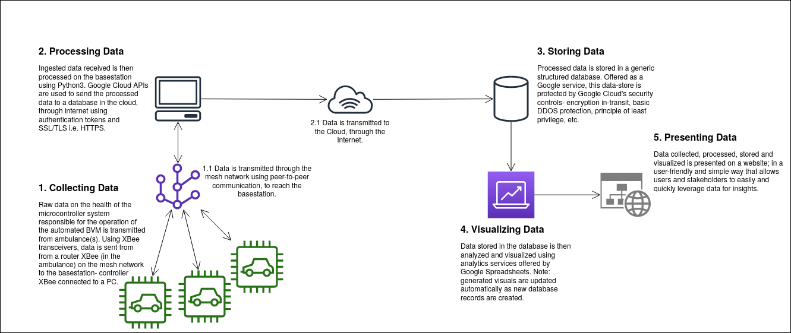
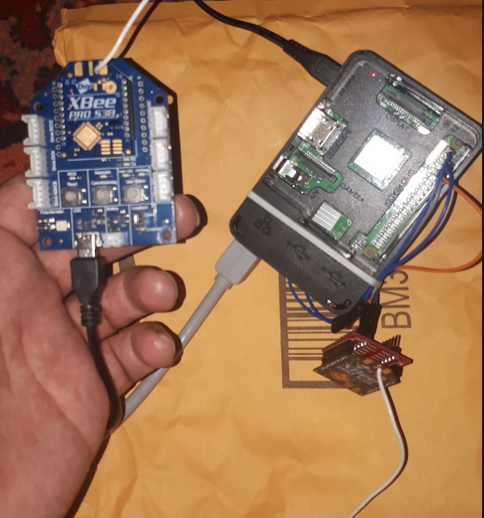
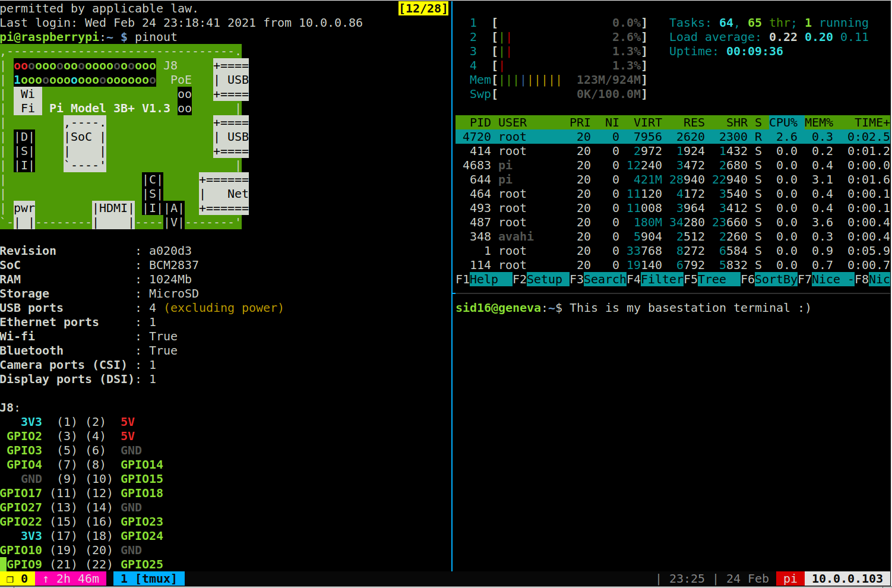
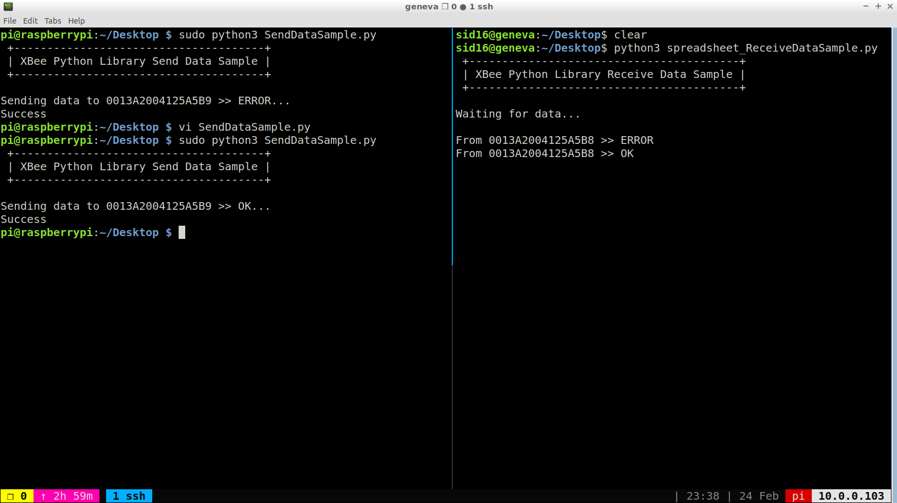

### Page Index
- <small><i>Table of contents</i></small>
    + [About](#about)
    + [Architecture](#application-architecture)
    + [Configuration Management](#configuration-management)
    + [Testing](#testing)
    + [Appendix](#appendix)

### About
Alpha release of a system health reporting application, utilizing XBee transceivers and Raspberry Pi3 to create a mesh network that uses peer-to-peer communication- visualizing and presenting the data transmitted within the nework as information, on a web-based dashboard.

### Application Architecture

**Figure1 shows the architecture of the system health reporting application as of it's Alpha release.**

### Configuration Management
Given the nature of this project, physical configurations of wiring and connection is maintated through basic wiring etiquette, learnt about in Electrical Engineering courses. Shown below are images that capture the physical set-up. Software Configurations for the basestation PC and Pi are managed using project documentation, and assets such as code are stored on Github. 

**Figure2 shows physical set-up of router XBee connected to the Pi (right), and contoller XBee (connected to PC).**

**Figure3 shows the how software based configuration are managed using the terminal. Leftmost pane shows the Pi's terminal. Top right pane shows the Pi's system resources viewer (that I use to manage how I use resources when programming on the Pi). Bottom right pane shows the terminal to interface with the basestation PC.**

### Testing
As of this Alpha release, a manual testing strategy is used. A Python3 script written on the sender side, and receiver side to send and receive data.

**Figure4 shows how the Python3 scripts are used to test sending and receiving of data.**

### Appendix
This section contains three subsection that demonstrate the results of this Alpha Release. 

### 1) Raw Data Processed at the Basestation
<object data="https://docs.google.com/document/d/e/2PACX-1vS3oPCumTwzkfEPce57R6XSrqXaXSzlxlnErdOtRytYMSZzNwuyC5B_lHdbQMxnkSNnNaLHhbkhO4Y_/pub?embedded=true"  width="576" height="356" seamless frameborder="0" scrolling="no"></object>
**Figure5 shows the first build- version 1.0 where instead of generic database, a .txt file was used to store messages.**

### 2) Processed Data Visualized
<object data="https://docs.google.com/spreadsheets/d/e/2PACX-1vTOtlUA6_ut3XFsuj0FlkWg8S-ZV8Y1agQ2JxbpRSM8WFk134k7edO6xV-e-v02GFxi0yZMvwdY2nlV/pubhtml?gid=0&amp;single=true&amp;widget=true&amp;headers=false" width="1000" height="500" seamless frameborder="0"></object>
**Figure6 shows the final build of the Alpha Release- data collected, processed and stored into a generic data-store on the Cloud. Please feel to scroll :)**

### 3) Data Presented
These two figures illustrate how the data collected can be visualized, and then presented on a website. This feature to embed visualizations will be used in the Beta release for better presentation of information.

<object data="https://docs.google.com/spreadsheets/d/e/2PACX-1vTOtlUA6_ut3XFsuj0FlkWg8S-ZV8Y1agQ2JxbpRSM8WFk134k7edO6xV-e-v02GFxi0yZMvwdY2nlV/pubchart?oid=2105202285&amp;format=interactive" width="576" height="356" seamless frameborder="0" scrolling="no"></object>
**Figure7 illustrates the System Status with respect to Time. Updated automatically as new database records are added.**

<object data="https://docs.google.com/spreadsheets/d/e/2PACX-1vTOtlUA6_ut3XFsuj0FlkWg8S-ZV8Y1agQ2JxbpRSM8WFk134k7edO6xV-e-v02GFxi0yZMvwdY2nlV/pubchart?oid=1815073469&amp;format=interactive" width="600" height="371" seamless frameborder="0" scrolling="no"></object>
**Figure8 illustrates Percentage of time Error and Ok states occurred. Updated automatically as new database records are added.**
