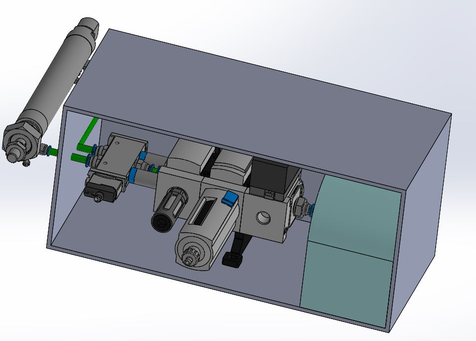

<h2>Components of the Pneumatic Design:</h2>

<ul>
  
  
  
  <li><b>Air Compressor:</b> Will be able to compress air upto 100psi and contain an inbuilt air reservoir such that the compressor does not run all the time, we recognize that they can be loud if kept running for long periods of time which could discomfort patients. The volume of the reservoir we can include for our POC will depend on our budget constraints for the time being.</li>
  
  <li><b>Air Preparation Unit:</b> This component has a filter at the bottom that separates excess dust or moisture coming in from the compressed air and drains these substances out from the auto drain attached. The top piece is the pressure regulator, it has a dial that allows us to configure the air pressure we wish to supply to the solenoid valve. The air prep unit was added to ensure the air being used was getting filtered before being supplied to the solenoid valve as moisture can wash away grease applied to the solenoid and within the cylinder rendering them unable to move. Sand and dust particles can also clog the valve as it requires 40 micron filtration. The auto drain will require periodic inspection by ambulance staff to ensure it is not getting clogged and functional. Lastly a manual switch that allows us the ability to cut our air flow from the compressor to the rest of the components. We were planning on adding a pressure sensor here that would allow us to ensure the air compressor was functioning properly and that there were no clogs in the filter/regulator section that were causing the air pressure to drop, however, due to a budget crunch we decided to move forward with our POC without it. </li>
  
  <li><b>Solenoid Valve/5-2 Valve:</b> This is a single coil valve that has 5 ports on it. The main air goes into this valve via port 1 as can be seen in the image above and flows out via ports 2 and 4 depending on whether 0 or 24V signal is being received (respectively). The power signal will be regulated via a Raspberry Pi connected to a power supply via a relay, the rate at which the signal switches from 0 to 24V will be determined based on the desired pumping rate and speed at which the piston releases completely after adding some load on it, we will determine this during the Beta Release. Pressurized air is released via port 2 to expand and port 4 to afford retraction. A silencer will be attached to both these outlets to minimise noise generated by the system. </li>
  
  <li><b>Pneumatic Cylinder:</b> Connects to ports 2 and 4 of the solenoid valve and based on the air flow the piston in the cylinder either releases or retracts. This cylinder has a stroke of 100mm and is about 250mm in length. There will be 2 sensors mounted on the cylinder that check whether the piston is being deployed and retracted fully within a certain time frame, if not we can flag that as an error scenario which can then be troubleshooted to determine where the fault lies within the system.</li>

 
  All of the pneumatic components will be connected together using tubings which may be color coated. We will show a video demonstration of the various connectors used to afford easy detachment of tubings when performing maintenance in our Beta Release.
  
   

   
  We plan on placing the air compressor, air prep unit and the solenoid valve together at a location that is yet to be determined based on where other medical equipment are situated in the ambulance and feasibility. These components will be placed inside of a casing, as can be seen in the figure above,  that is easily accessible incase maintenance or replacement is required. The positioning of the pneumatic cylinder shown above is to visualize its connection to the solenoid valve, in actuality the tubes connecting the two will be much longer (based on how far apart the two components are from one another).
   
In trying to making our design portable we realized that making a compact carriabble ventilator would not be technically feasible because of the amount and weight of components needed so we opted to make a semi-portable design. Our design will be restricted to the ambulance but will allow the automated BVM pumping mechanism to be brought to a patient wherever they are situated, regardless of the height or placement of their bed. Our design does not require the medical professionals to provide extensions to the endotracheal tube or mask end to connect with the BVM as we make sure our system enables all functionalities and conveniences a manual BVM provided.
   
  <b>Design Video: </b> [<b>A detailed explanation of the Design</b>](https://youtu.be/pYWL6JigDXs) 

<h4>Below you can find the links to all necessary design documents and the BOM: </h4>

  -[Bill of Materials](https://github.com/SidB16/ENG4000-Team-A-F/blob/main/docs/gate4/Images/Billing/BOM.PDF)
     
  -[3D Model of the Arm on which the BVM and Cylinder are mounted](https://github.com/SidB16/ENG4000-Team-A-F/blob/main/docs/gate4/Images/3dman.md) 
     
  -[3D Model of the Components present inside of the Casing](https://github.com/SidB16/ENG4000-Team-A-F/blob/main/docs/gate4/Images/model.md)
     
  -[Schematic of the Pneumatic Design](https://github.com/SidB16/ENG4000-Team-A-F/blob/main/docs/gate4/Images/schem.md)

</ul>

