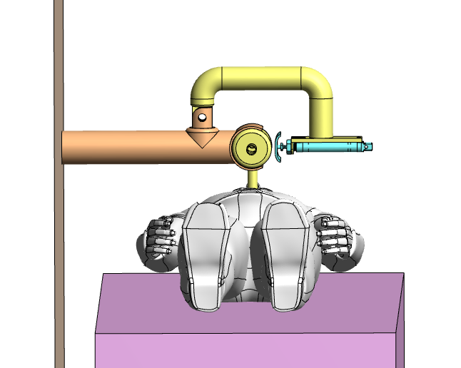
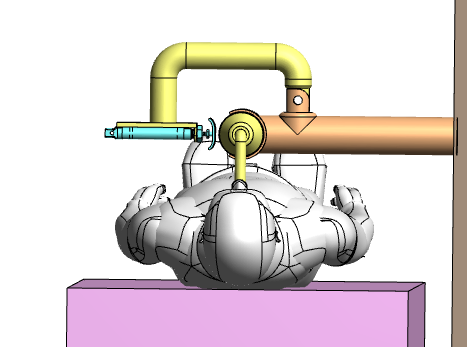
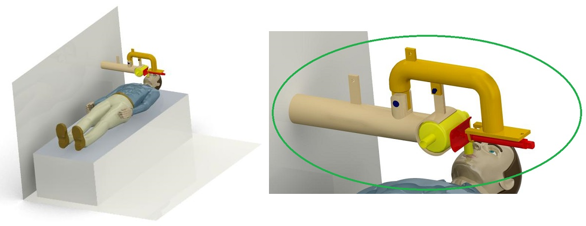

<h3> The Figures depicts the Model's implementation in an Ambulance setting </h3>

<ul>

<li>
[Intial 3D model PDF](https://github.com/SidB16/ENG4000-Team-A-F/blob/main/docs/gate4/Images/3dAmbuMan/pro1.PDF)
</li>
<li>
[Refined 3D model PDF](https://github.com/SidB16/ENG4000-Team-A-F/blob/main/docs/gate4/Images/3dAmbuMan/open_roof.pdf)
</li>
  
Once you open the 3d PDF file, you can open it using Adobe Reader. Once you open it, you will have to enable the feature by clicking on options-->trust this document always. Give  it some time and it should be seen!

</ul>
