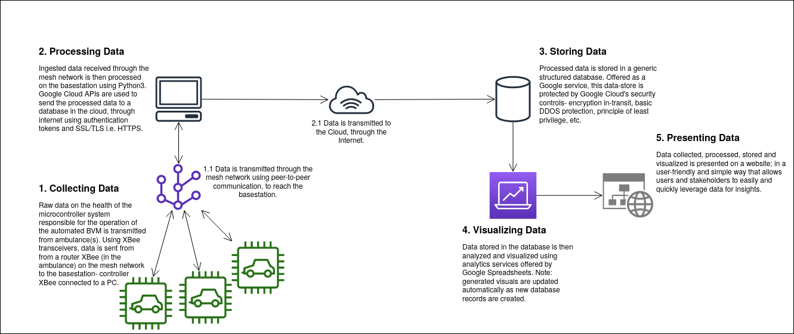
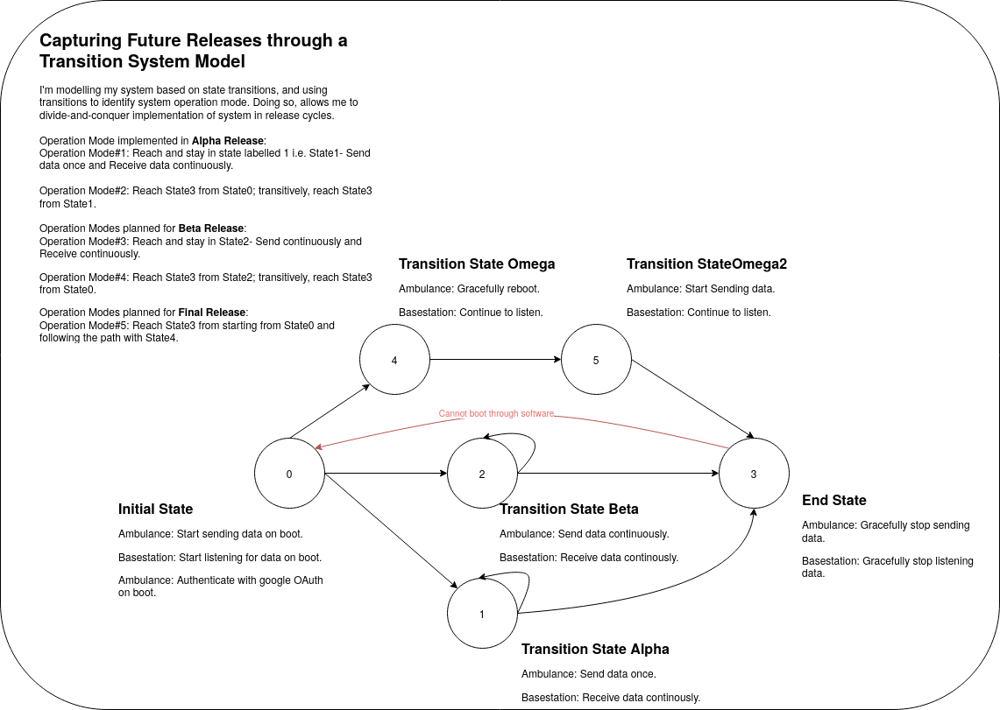
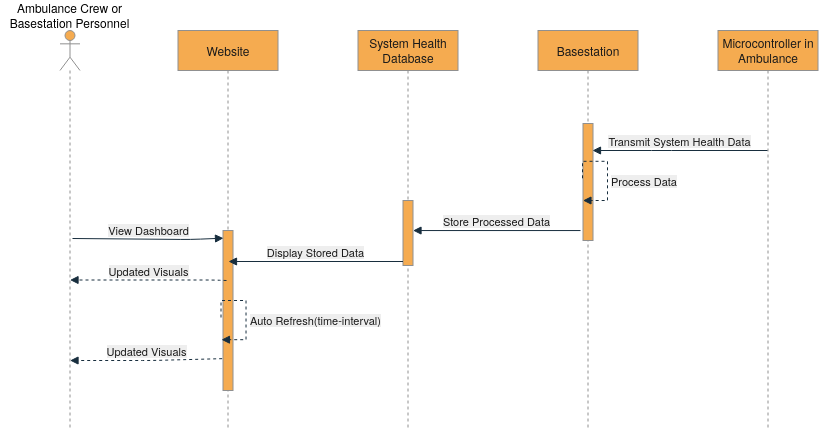
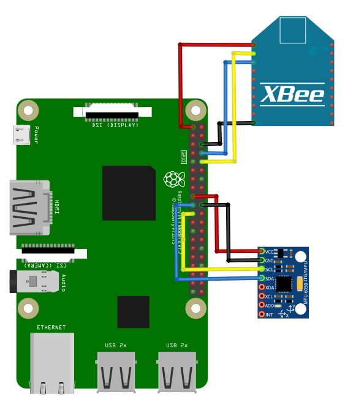
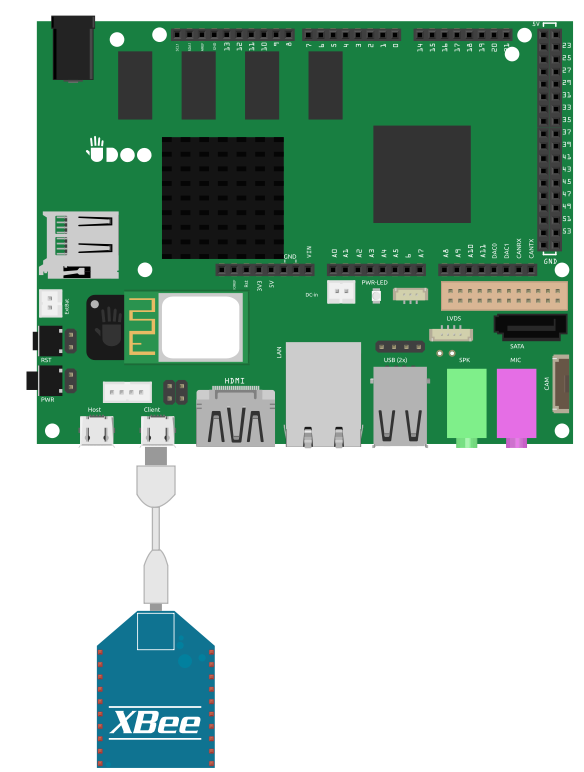
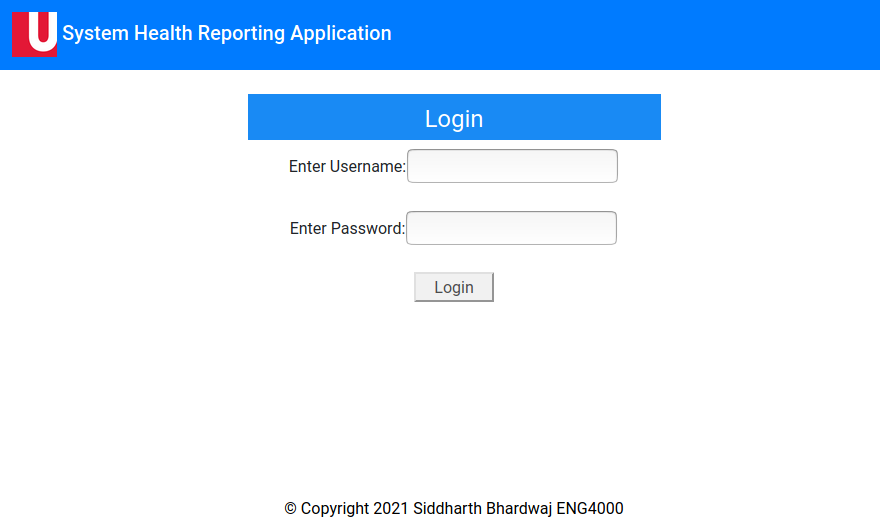

### Page Index
- [Technical Volume](#technical-volume)
  * [Executive Summary](#executive-summary)
  * [Product Vision](#product-vision)
  * [Solution Architecture](#solution-architecture)
    + [Architecture Diagram](#architecture-diagram)
    + [System State(s) Diagram](#system-states-diagram)
    + [Solution Sequence Diagram](#solution-sequence-diagram)
  * [System-As-Built Hardware](#system-as-built-hardware)
  * [System-As-Built Software](#system-as-built-software)
  * [Technical Demonstration Videos](#technical-demonstration-videos)
    + [Alpha Release](#alpha-release)
    + [Beta Release](#beta-release)
    + [Omega Release](#omega-release)
    + [Data Propogation Reliability Test](#data-propogation-reliability-test)
    + [Error Notification Feature](#error-notification-feature)
    + [Final Release](#final-release)
  * [Deep-dive into Code](#deep-dive-into-code)
    + [Sender Side](#sender-side)
    + [Reciever Side](#reciever-side)
    + [Data Visualization and Presentation Side](#data-visualization-and-presentation-side)
    + [Tested Software Configurations](#tested-software-configurations)
- [Financial and Management Volume](#financial-and-management-volume)
  * [Backlog and Planned set of Deliveries](#backlog-and-planned-set-of-deliveries)
  * [Estimated Budget for Rebuild](#estimated-budget-for-rebuild)
  * [Business Plan](#business-plan)
  * [Failures and Lessons Learnt](#failures-and-lessons-learnt)
- [Appendix](#appendix)
  * [Video Transcripts](#video-transcripts)

## Technical Volume
This volume is about the technical aspects on this project, presenting information about the system-as-designed and system-as-built.

### Executive Summary
Addresses: What is this project about and Why?

Final release of a solution that performs real-time analytics on the health of microcontroller systems in ambulance(s).

At the start of the winter semester, our team decided to split into two-subteams. One dealing with the pump device, and the other dealing with failure reporting and visualizing system health. I (Siddharth Bhardwaj) took ownership of the latter. (More information about the earlier phase of our project can be found [**here**](https://drive.google.com/file/d/1fbR2aad2eUqU_aILc2vjHCjWiD7Ffg1f/view?usp=sharing).) In this part of the project, under the supervision of Professor.Franz Newland, I’m building a robust mechanism to collect health data of the automated BVM system. The end-goal of this solution is to share this data real-time with the ambulance crew and base station personnel that monitor the health of the system.

In this solution, I create a mesh network of XBee transceivers to continuously send and recieve a Raspberry Pi's health data. Data on the mesh network is transmitted through peer-to-peer communication, and the microcontroller's health data is dependent on a real-time ouput from a gyroscopic sensor. (The gyroscope sensor simulates a automated Bag-Value-Mask (BVM) pumping mechanism in operation, inside of the ambulance). As system health data from the Pi is continuously transmitted, it is processed on a Basestation PC before being stored real-time onto a structured database, on the Cloud. As system health data is stored realtime, it presented realtime- as visuals on web-based analytics dashboard. A "open-source and free first" approach is used where Python3 and free Google services such as Google Spreadsheets and Google APIs (under a trial account) are used to implement a mechanism for data processing, data storage onto the Cloud, and data visualization on a stand-alone website.  

### Product Vision
Addresses: What is it doing?

This product is:
* Providing a mechanism to report issues.
* Providing a low cost, mesh based communication- allowing others abumblances to support a crew that might have fault.
* Providing a way to visualize data as gathered, real-time.
* Providing a way to push notifications to users if an issue is detected.
* Providing a way to configure the application during run-time, without stopping it.
* Providing a way to read health data from any type of pumping mechanism, using a gyroscopic sensor.

At the moment there is no automated reporting of device failures in an Ambulance operating in Gujarat, India. Thus, there is a need for automated failure reporting for mobile medical devices, used in various medical fields.

In essence, through this solution, the ambulance crew does not need to manually report/call-in a failure to the basestation personnel. Furthermore, it allows one ambulance crew to support another, incase one experiences fault. The value is: if a automated BVM unit fails then a higher load is placed on the crew, on top of pressure of caring for patients. This solution minimizes the high workload placed on the ambulance crew, allowing them to focus on their patients while providing a robust mechanism for reporting system failure. Furthermore, system health data that is collected realtime, is visualized realtime i.e. is leveraged to allow base station personnel to formulate a meaningful strategy to handle system failure (for example, re-route other active ambulances on the mesh network for support, incase one ambulance is experiencing fault with it's BVM). 

With more features added post-alpha and post-beta releases, this solution now supports: sending push notifications to base station personnel through email or cell, reading data from a gyroscope sensor that can be connected any type of pumping device the ambulance crew may be working with, and has significantly enhanced product configurability and ease-of-use through reading parameterized (often hard-coded) data from a modulated and stand-alone, config file. Also, reliability of visual generation was also enhanced based on testing in [Data Propogation Reliability Test section](#data-propogation-reliability-test). Please refer to  [Technical Video Demonstration section](#technical-demonstration-videos) to see demonstrations of product evolution and functionality.

### Solution Architecture
This section presents the system-as-desgined and system-as-built through a series of diagrams, which were used to architect this project's solution. The presented diagrams range from high-level to low(er)-level.

#### Architecture Diagram
 
**Figure1** shows the end-to-end architecture of this application- capturing the flow of data in the system-as-designed, and the system-as-built. It is also the highest-level view of this solution- showing interactions between the microcontroller transmitting it's health infromation (from inside an ambulance) to the website presenting that transmitted data as visuals on a analytics dashboard. Each phase of the solution is labelled (from 1 to 7), and a brief description is provided for each section. 

#### System States Diagram
 
**Figure2** shows the Alpha, Beta and (other) Omega releases in the form of a state diagram. This figure absracts away individual hardware and software components, considering them as a whole i.e. a system. A breif description about the state diagram, and each release is provided in the figure. For more information please refer to corresponding release(s) in the [Technical Video Demonstration section](#technical-demonstration-videos).

#### Solution Sequence Diagram
 
**Figure3** presents a lower-level view of this solution, compared to the architecture diagram. This figure considers the target user(s), and identifies their interaction with each component of the solution. In it, a Ambulance Crew or Basestation personnel memebers wants to view the dashboard. To do so they access the website, which is in production, and is updating the presentated analytics visuals; real-time as more microcontroller health data is transmitted (from the microcontroller in the ambulance, connected to an XBee transiever) and recieved on the Basestation.

### System-As-Built Hardware
This section details the hardware and software configuration of the hardware components used in this project-- a Raspberry Pi 3 B+ and Dell Optiplex 7010 desktop are used as a the "ambulance" and "basestation", respectively. The key configuration for data transmission is mode of the XBee transiver, to which the Pi or PC is connected too. 

##### Raspberry Pi 3 B+-- transmits health data
**Figure4** shows the fritzing diagram of microcontroller used in the the system-as-built, in this final release. It shows the Raspberry Pi B+ used, along with the XBee transiever and Gyroscopic sensor connected to it. 
 
Configuration(s): 
Operating System:  Raspberry Pi OS 32-bit (Released: 2021-01-11, 1.1GB) 
Manufacturer and Model: CanaKit, Raspberry Pi 3 Model B+  
Processor: Broadcom BCM2837B0, Cortex-A53 (ARMv8) 64-bit SoC @ 1.4GHz 
Python version: Python 3.6.9 
Memory: 1GB LPDDR2 SDRAM 
XBee Model: XBee Pro 538 
XBee Mode: Router 
XBee Transport Mode: API 2 
XBee Connection Port: /dev/ttyS0 
XBee Baud Rate: 9600 
XBee MAC address: 0013A2004125A5B9 
Gryoscope Sensor: MPU-6050  
Gryoscope Sensor Version: SEN-11028  

**Note**: XCTU was not installed on the Pi. This was because of software architecture constraints where XCTU executable code cannot run on a ARM based processor.  

##### Basestation PC-- recieves health data
**Figure5** shows the fritzing diagram of Basestation PC used in the the system-as-built. It shows the chipset of my Desktop PC connected to the XBee transiever through a USB cord. 
 
Configuration(s): 
Operating System:  Lubuntu 18.04 
Manufacturer and Model: Dell, Optiplex 7010 
Processor: 2.3 GHz Dual-Core Intel Core i5 
Python version: Python 3.6.9 
Memory: 8.0 GB 
XBee Model: XBee Pro 538 
XBee Mode: Controller 
XBee Transport Mode: API 2 
XBee Connection Port: /dev/ttyUSB0 
XBee Baud Rate: 115200 
XBee MAC address: 0013A2004125A5B8 
XCTU Version: 6.5.5

### System-As-Built Software
This section presents the webapplication dashboard of this project.

**Figure6** shows the system health reporting application. Please click on the image to access the login page to the dashboard. To access login credentials, email sid16@my.yorku.ca. 
 
This same application, in Beta release version can be accessed from [***here***](http://webdashboard-env.eba-kz9hmne2.us-east-1.elasticbeanstalk.com/).  

I cover the written code in-depth in section [Deep-dive into Code](#deep-dive-into-code). However, in short, I have two python executables running- one on the Pi, and the other on the Basestation PC. The Pi sends data about it's health to the Basestation PC through XBee Zigbee protocol python APIs. I also detail python libraries used and their versions in [Tested Software Configurations](#tested-software-configurations) section.

### Technical Demonstration Videos
This section shows the technical demonstration of each planned release of this project.

#### Alpha Release 
Shows **Figure7** (below) that demonstrates the end-to-end solution in it's alpha release state. This video was recorded on March 22nd. 

##### Time Stamps
🔨 🔨 🔨

#### Beta Release 
Shows **Figure8** (below) that demonstrates the end-to-end solution in it's Beta release state. This video was recorded on March 22nd. 

##### Time Stamps
🔨 🔨 🔨

#### Omega Release
Shows **Figure9** (below) that demonstrates the end-to-end solution in it's (other i.e.) Omega release state. This video was recorded on March 22nd. 

##### Time Stamps
🔨 🔨 🔨

#### Data Propogation Reliability Test
Shows **Figure10** (below) that demonstrates a test performed to improve data propogation reliability on the web-based anaytics dashboard. The application was in Beta Release during this demonstration. This video was recorded on March 29th. 

##### Time Stamps
🔨 🔨 🔨

#### Error Notification Feature
Shows **Figure11** (below) that demonstrates a push-notification feature implemented to improve user convinience. The application was in Beta Release during this demonstration. This video was recorded on March 29th. 

##### Time Stamps
🔨 🔨 🔨

#### Final Release 
Shows **Figure12** (below) that demonstrates the final release of this application. This video was recorded on April 4th. **Note:** key moments of this demonstration video have organized into "chapters" (to improve viewer convinience), if you follow the link below to the video on Youtube. 
 

##### Key Moments (TBD-- Franz Feedback here) 
* Introduction and Summary of Content Covered in Video: [***here***](https://www.youtube.com/embed/0CmlQ8UWoUE?start=0&end=66)
* Demonstration Set-up: 
* Demonstration of Gyroscopic sensor in-operation:
* Demonstration of Sending and Receiving data continuously (i.e. transition state Beta): 
* Demonstration of Sending and Receiving data on Reboot (i.e. transition state Omega):
* Demonstration of Error-push-notification feature:
* Conclusion:

##### Video Transcript
[Final Release Video Demonstration Transcript](video_transcripts/finalrelease_video_transcript.pdf)

### Deep-dive into Code
This section presents a deep-dive into the code written for the project- considering the "sender side" and "reciever side". Also, it shows the tested software configurations (such as python libraries, etc) used to achieve expected and presented (above in technical demos section) functionality for this solution.

#### Sender Side
**Figure13** is a video in which I deep-dive into 'Sender Side' code. Please click on the image to access video. 
 
The code shown in above video can be accessed from [***here***](final_release_code/sender_side/).  

#### Reciever Side
**Figure14** is a video in which I deep-dive into 'Sender Side' code. Please click on the image to access video. 
 
The code shown in above video can be accessed from [***here***](final_release_code/reciever_side/).  

#### Data Visualization and Presentation Side
**Figure15** is a video in which I deep-dive into 'Data Visualization and Presentation Side' code. Please click on the image to access video. 
 
The code shown in above video can be accessed from [***here***](final_release_code/data_visulization_and_presentation_side/).  

#### Tested Software Configurations
**Figure16** is a video in which I present the sender side and reciever side software configurations as utilized in my production environment. Please click on the image to access video. 
 
The 'requirements.txt' files shown in above video can be accessed from [***here for Reciever side***](final_release_code/reciever_side/requirements.txt), and [***here for Sender side***](final_release_code/sender_side/requirements.txt).  

## Financial and Management Volume
This volume is about the financial and management aspects on this project, examining project progress as planned versus as executed. Furthermore, presents a failure report, and lessons learnt section.

### Backlog and Planned set of Deliveries
**Figure17** is a video in which I address what did I ended up not doing, doing, and how things went different (if at all).
 
 

### Estimated Budget for Rebuild

### Business Plan

### Failures and Lessons Learnt

## Appendix
### Video Transcripts
* [Alpha Release Video Transcript](video_transcripts/alpha_video_transcript.pdf)
* [Beta Release Video Transcript](video_transcripts/beta_video_transcript.pdf)
* [Omega Release Video Transcript](video_transcripts/omega_video_transcript.pdf)
* [Data Reliability Test Video Transcript](video_transcripts/omega_video_transcript.pdf)
* [Error Notification Feature Video Transcript](video_transcripts/errornotification_video_transcript.pdf)

## References
1. Deliverables Documentation.ENG4000 Fall-Winter-2020-21. Retrieved from: https://eclass.yorku.ca/eclass/course/view.php?id=6123

